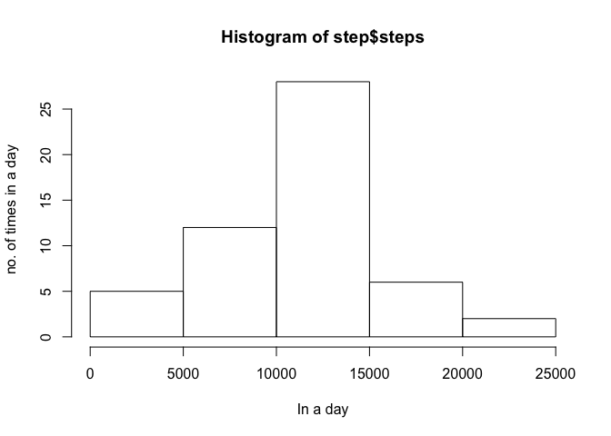
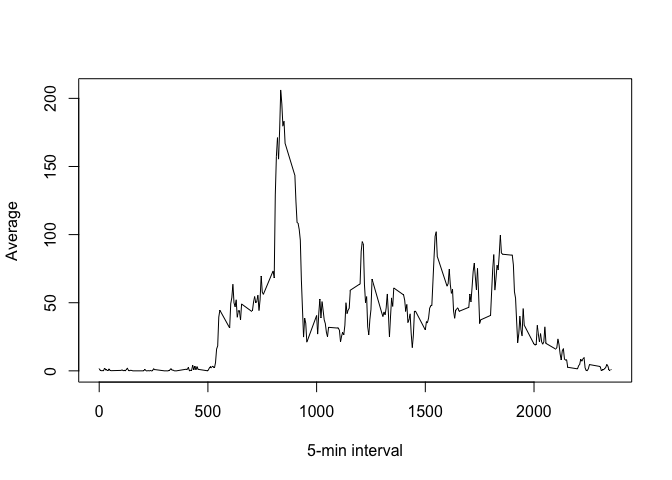
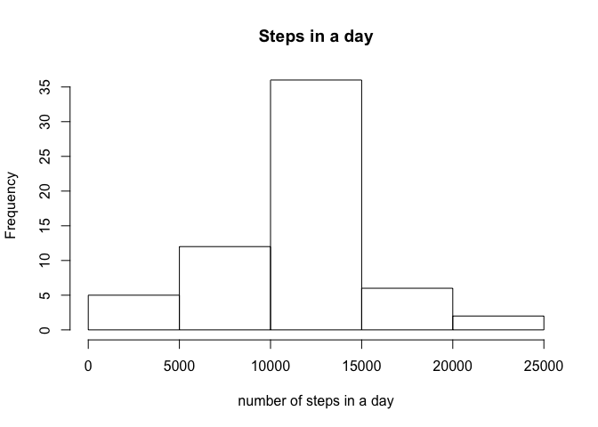
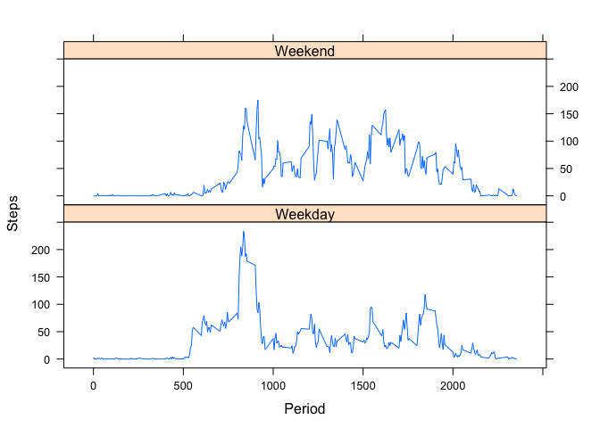

# Reproducible Research: Peer Assessment 1


## Loading and preprocessing the data

```r
library(knitr) 
user_data <- read.csv("activity.csv",colClasses = c("numeric", "character", 
    "numeric"))
user_data$date <- as.Date(user_data$date, "%Y-%m-%d")
head(user_data)
```

```
##   steps       date interval
## 1    NA 2012-10-01        0
## 2    NA 2012-10-01        5
## 3    NA 2012-10-01       10
## 4    NA 2012-10-01       15
## 5    NA 2012-10-01       20
## 6    NA 2012-10-01       25
```


## What is mean total number of steps taken per day?

```r
library(lattice) #To plot the histogram when needed
step <- aggregate(steps ~ date,user_data,sum,na.rm = TRUE)
head(step)
```

```
##         date steps
## 1 2012-10-02   126
## 2 2012-10-03 11352
## 3 2012-10-04 12116
## 4 2012-10-05 13294
## 5 2012-10-06 15420
## 6 2012-10-07 11015
```

```r
as <- mean(step$steps,na.rm=TRUE)
as
```

```
## [1] 10766.19
```

```r
median(step$steps,na.rm=TRUE)
```

```
## [1] 10765
```

```r
hist(step$steps,xlab="In a day",ylab="no. of times in a day")
```

 


## What is the average daily activity pattern?

```r
t <- tapply(user_data$steps,user_data$interval,mean, na.rm = TRUE)
plot(row.names(t), t, type = "l", xlab = "5-min interval", 
    ylab = "Average")
```

 

```r
max <- which.max(t)
names(max)
```

```
## [1] "835"
```


## Imputing missing values
The missing values are imputed using a relatively simple R code. 

```r
## No. of NAs is found by finding the missing value and then summing. 
a <- sum(is.na(user_data))  
##To populate missing values, they are replaced with the mean values calculated over the interval. In the for loop the presence of NAs is being checked and the values are being placed in case an NA occurs.
avg <- aggregate(steps ~ interval, data = user_data, FUN = mean)  
NAs <- numeric()   
for (i in 1:nrow(user_data)) {
    it <- user_data[i, ]
    if (is.na(it$steps)) {
        steps <- subset(avg, interval == it$interval)$steps
    } else {
        steps <- it$steps
    }
    NAs <- c(NAs, steps)
}
naya <- user_data
naya$steps <- NAs
st2 <- aggregate(steps ~ date,data = naya,sum, na.rm = TRUE)
##The histogram is made and calculating the mean and median also let's us know whether or not there is any impact of imputing values.
hist(st2$steps, main = "Steps in a day", xlab = "number of steps in a day")
```

 

```r
mean(st2$steps)
```

```
## [1] 10766.19
```

```r
median(st2$steps)
```

```
## [1] 10766.19
```

## Are there differences in activity patterns between weekdays and weekends?

```r
d <- weekdays(user_data$date)
day <- vector()
for (i in 1:nrow(user_data)) {
    if (d[i] == "Saturday" | d[i] == "Sunday") {
        day[i] <- "Weekend"
    } else {
        day[i] <- "Weekday"
    }
}
user_data$day <- day
user_data$day <- factor(user_data$day)

step <- aggregate(steps ~ interval + day, data = user_data, mean)
names(step) <- c("interval", "day", "steps")
xyplot(steps ~ interval|day, step, type = "l", layout = c(1,2), 
    xlab = "Period", ylab = "Steps")
```

 
